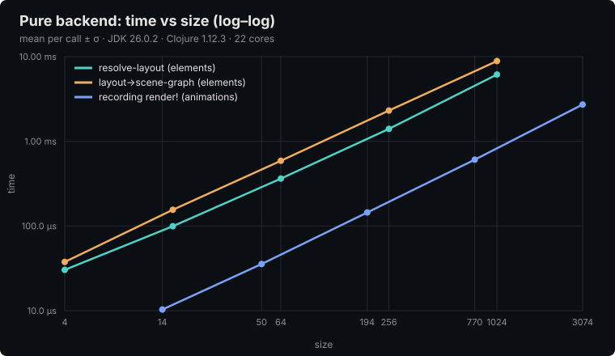
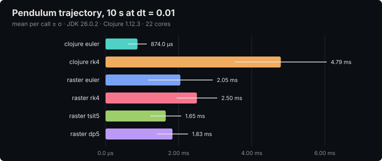
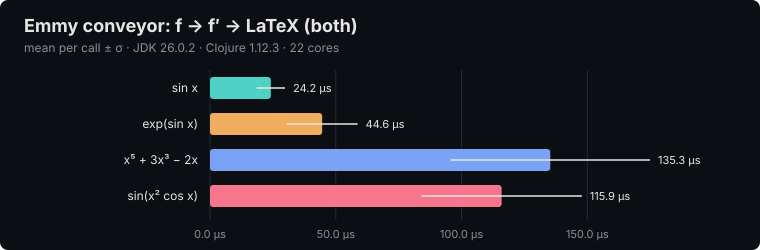

# desargues

**Emmy + Manim — backend-neutral mathematical animation in Clojure**

desargues bridges [Emmy](https://github.com/mentat-collective/emmy) (symbolic
mathematics) and [Manim Community Edition](https://www.manim.community/)
(mathematical animation) through [libpython-clj](https://github.com/clj-python/libpython-clj).
It computes derivatives symbolically, converts them to LaTeX, and renders them
behind a **backend-neutral scene facade**: the same scene code writes an mp4
under Manim, or records a pure EDN scene graph with no Python at all.

**Landing page:** <https://mentat-collective.github.io/desargues/> — a
[plato](https://github.com/BuddhiLW/plato) deck built by desargues itself, with
live scenes and the benchmark charts below.

- 🧮 **Symbolic mathematics** — define functions, differentiate, simplify via Emmy
- 🎬 **Animation** — the Emmy → LaTeX → Python → Manim pipeline
- 🔌 **Backend-neutral facade** — `desargues.scene` programs to a protocol; a pure
  `RecordingBackend` renders the same scene to EDN
- 📐 **Layout algebra** — an elm-ui-inspired layout DSL with a pure extent
  estimator (measure → resolve → realize)
- 🧭 **Trajectories behind a port** — `TrajectorySolver` with Clojure RK4 built in
  and raster's adaptive solvers one alias away
- ⚙️ **Environment-driven config** — no machine paths baked into source

## Install

### As a library

```clojure
;; deps.edn
{:deps {io.github.mentat-collective/desargues
        {:git/tag "v0.1.1" :git/sha "6d26609"}}}
```

`main` carries more than the last tag (see [CHANGELOG](doc/CHANGELOG.md)); pin a
sha from `main` to get it.

### From a clone

```bash
git clone https://github.com/mentat-collective/desargues
cd desargues
clojure -P            # pre-fetch dependencies (about 10 s)
bb doctor             # or: clojure -M:doctor
```

Requirements: **JDK 11+** and the **Clojure CLI**. [babashka](https://babashka.org)
is optional; every `bb` task below is one `clojure` command. That is all the pure
half needs: the recording backend, the layout algebra, the Emmy conveyor and the
physics run with no Python.

### The Manim backend

Rendering video needs one conda env with Manim (and its LaTeX + ffmpeg):

```bash
conda create -n manim -c conda-forge python=3.12 manim
conda activate manim      # sets CONDA_PREFIX; desargues.config picks it up
bb doctor                 # every row should read ok
```

`clojure -M:doctor` reports each requirement as `ok` / `missing` with the fix:
the JVM, the recording backend, the resolved conda prefix, `import manim`,
`latex`, `ffmpeg`. It exits 0 when the pure path works; the Manim rows are advisory.

Paths are **derived from the environment** by `desargues.config`: it reads
`DESARGUES_CONDA_PREFIX`, else `CONDA_PREFIX`, and probes `bin/python`,
`lib/libpython3.x.so` and `site-packages` under it. To target an env that is not
the active one, or to override a single path:

| Variable | Purpose |
|---|---|
| `DESARGUES_CONDA_PREFIX` | conda env root (wins over `CONDA_PREFIX`) |
| `DESARGUES_MANIM_PYTHON` | python executable |
| `DESARGUES_MANIM_LIBPYTHON` | `libpython*.so` |
| `DESARGUES_MANIM_SITEPACKAGES` | site-packages dir |
| `DESARGUES_PROJECT_ROOT` | root whose `py/` goes on Python `sys.path` |
| `DESARGUES_QUALITY` | render quality (default `medium_quality`) |

`(desargues.config/manim-config)` returns the resolved map, or throws a message
naming these variables. Verified against Manim Community 0.21.0.

## Sixty seconds, no Python

```clojure
(require '[desargues.scene :as s]
         '[desargues.scene.data :as rec]
         '[desargues.layout.core :as l])

;; A declarative layout, realized to an EDN scene graph
(rec/layout->scene-graph "hello"
  (l/column {:padding 0.6 :spacing 0.4 :align :center-x}
    (l/text "Reserves")
    (l/math "\\Delta M = 1000"))
  {})
;; => {:scene "hello" :nodes {1 {:node :text ...} 2 {:node :math ...}} :steps [...] ...}

;; An imperative scene, recorded instead of rendered
(defn construct [stage]
  (let [t (s/text "Hello")]
    (s/play! stage (s/appear t))
    (s/hold! stage 2)))

(s/with-backend (rec/recording-backend)
  (s/render! "demo" construct))
;; => {:scene "demo" :nodes {...} :steps [{:step :play ...} {:step :hold :seconds 2}]}
```

That data is what [plato](https://github.com/BuddhiLW/plato) plays in the browser.

## Quick start with Manim

```clojure
(require '[desargues.api :as v])
(require '[emmy.env :as e])

(v/init!)                          ; bring up Python/Manim (via desargues.config)

(def f  (v/func "f" #(e/sin %)))   ; a MathFunction
(def df (v/derivative f))          ; Emmy differentiates functions

(v/to-latex f)                     ; => "\\sin\\left(x\\right)"
(v/to-latex df)                    ; => "\\cos\\left(x\\right)"
(v/animate-derivative f)           ; render f and f' side by side
```

The same `construct` fn from above renders for real with the default (Manim)
backend, `(s/render! "demo" construct)`, and a layout renders with

```clojure
(v/render-layout! "balance"
  (v/column {:padding 0.6 :spacing 0.4 :align :center-x}
    (v/text "Reserves")
    (v/math "\\Delta M = 1000")))
```

Videos land under `media/videos/<quality>/`.

## Commands

| Task | Command | Notes |
|---|---|---|
| Environment check | `bb doctor` · `clojure -M:doctor` | pure path + Manim env |
| Tests | `bb test` · `clojure -M:test` | Manim suites skip without the env |
| Tests + raster | `bb test:dynamics` · `clojure -M:test:dynamics` | solver conformance |
| Type check | `bb typecheck` · `clojure -M:dev -m desargues.typecheck` | Typed Clojure gate |
| Benchmarks | `bb bench` · `clojure -M:bench:dynamics` | add `--manim` for render timings |
| Landing page | `bb site` | plato deck → `dist/site` |
| Demos | `clojure -M:run [intro\|step N\|quickstart\|derivative]` | needs the Manim env |
| Dev REPL | `clojure -A:dev` | `dev/` sources, orchestra, the checker |

## Benchmarks

`bb bench` measures the pure pipeline with a warm-up and batched samples, writes
`bench/results/latest.edn`, and regenerates the charts below (`doc/bench/`).
`--manim` adds one Manim render per quality. Numbers are from one machine and
change with the JVM; run it on yours.







What they say: the recording backend and the layout algebra are linear in the
number of elements (a thousand-element layout resolves in milliseconds), a
10-second pendulum at `dt = 0.01` costs a few milliseconds with any solver, and
differentiating a function plus rendering both to LaTeX is tens of microseconds.

## Architecture

Layered, with the dependency arrow pointing inward toward the pure domain:

```
api            desargues.api            high-level facade (symbolic → animation)
scene facade   desargues.scene          backend-neutral animation API  ── DIP seam
  ├ backend    desargues.scene.manim    ManimBackend  (draws via libpython-clj)
  └ backend    desargues.scene.data     RecordingBackend (records EDN, no Python)
layout         desargues.layout.*       elm-ui layout algebra + pure extent measure
pipeline       desargues.pipeline.emmy  Emmy → LaTeX → Python, pure CPPB conveyor
physics        desargues.videos.physics TrajectorySolver port (+ raster adapter)
manim          desargues.manim.*        low-level Manim mobject/animation bindings
domain         desargues.domain.*       pure Clojure + Emmy, Typed-Clojure-annotated
config         desargues.config         env-derived settings (the Collect layer)
```

The seam is `desargues.scene.protocols`: both backends implement the same
protocols, so consumers depend on the abstraction, never on Manim (Dependency
Inversion). Because the pure `RecordingBackend` and the Manim backend are
interchangeable behind that facade (Liskov substitution), the neutrality is
*checkable*: run any scene through the recording backend and assert on the data.

```
desargues/
├── src/desargues/        api, scene (+ manim, data backends), layout, pipeline,
│                         domain, infrastructure (raster adapter), devx, videos, config
├── py/                   Python scene definitions importable via desargues.config
├── test/desargues/       pure suites + Python-guarded suites (skip without the env)
├── bench/                desargues.bench + charts        (clojure -M:bench)
├── site/                 the plato landing page deck     (bb site)
├── dev/                  REPL helpers, typecheck gate
└── doc/                  guides, ADRs, changelog
```

Typed Clojure is split across the two classpaths: the annotation runtime is a
normal dependency because `desargues.domain.*` carry `t/ann` annotations, while the
checker lives in the `:dev` alias. The raster solvers live in `:dynamics` because
raster pins a newer typed runtime.

## Documentation

- [ARCHITECTURE.md](doc/ARCHITECTURE.md) — SOLID/DDD design and the layer contracts
- [BOUNDED_CONTEXTS.md](doc/BOUNDED_CONTEXTS.md) — the domain / rendering / devx contexts
- [ADR_CODE_QUALITY.md](doc/ADR_CODE_QUALITY.md) — code quality standards
- [CLEAN_API_GUIDE.md](doc/CLEAN_API_GUIDE.md) — the `desargues.api` facade
- [EMMY_MANIM_GUIDE.md](doc/EMMY_MANIM_GUIDE.md) · [EMMY_MANIM_QUICKREF.md](doc/EMMY_MANIM_QUICKREF.md) — the Emmy → LaTeX → Manim pipeline
- [EQUATION_EVALUATION_GUIDE.md](doc/EQUATION_EVALUATION_GUIDE.md) — evaluating functions and tables
- [MANIM_SETUP.md](doc/MANIM_SETUP.md) — Manim via libpython-clj, troubleshooting
- [BRACHISTOCHRONE.md](BRACHISTOCHRONE.md) — the brachistochrone derivation videos
- [ROADMAP.md](doc/ROADMAP.md) — the DevX hot-reload roadmap
- [CHANGELOG.md](doc/CHANGELOG.md)

DevX (Figwheel-style hot reload of animation segments) is documented in
[CLAUDE.md](CLAUDE.md#devx-module-hot-reload--smart-preview-system).

## Resources

- Emmy — https://github.com/mentat-collective/emmy
- Manim Community — https://www.manim.community/
- libpython-clj — https://github.com/clj-python/libpython-clj
- plato — https://github.com/BuddhiLW/plato

## License

This program and the accompanying materials are made available under the terms of
the Eclipse Public License 2.0 (https://www.eclipse.org/legal/epl-2.0/), or (at
your option) the GNU General Public License, version 2 or later, with the GNU
Classpath Exception (https://www.gnu.org/software/classpath/license.html).
